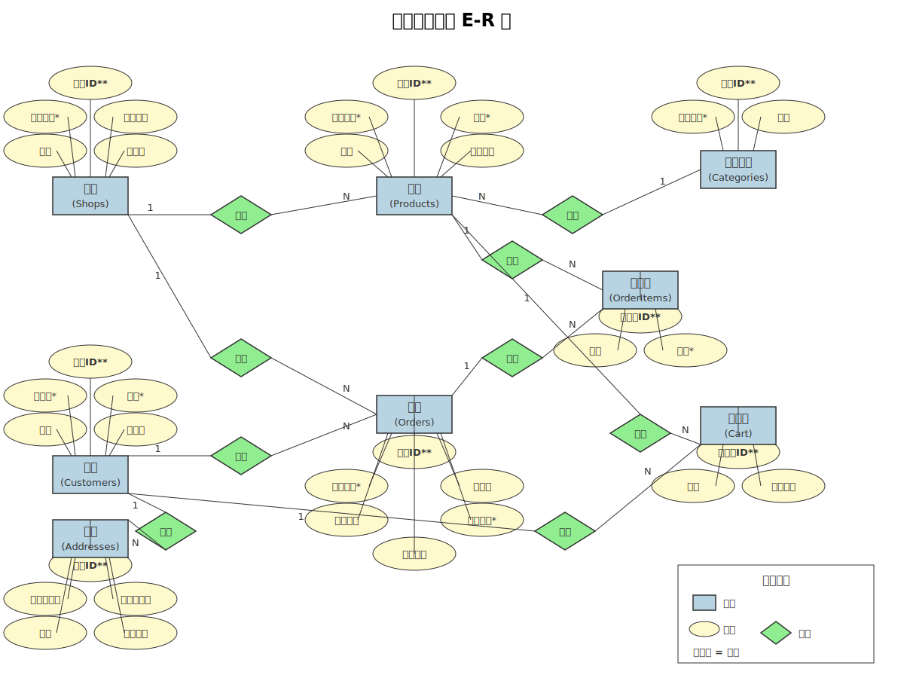

# 🍔 外卖商城系统

<p align="center">
  
  
  
  
  
</p>

<p align="center">
  <b>基于 Vue 3 + Express + MySQL 的全栈外卖商城系统</b>
</p>

> 一个功能完善的外卖订餐平台，支持商家浏览、商品选购、购物车管理、订单处理、销售统计等核心功能。采用前后端分离架构，数据库层面通过触发器实现库存自动维护，保证数据一致性。

---

## ✨ 项目亮点

### 🛒 智能购物车
- **本地持久化**：基于 localStorage 实现购物车数据持久化，刷新页面不丢失
- **实时计算**：自动计算商品总价、配送费、应付金额
- **跨商家管理**：支持多商家商品同时加入购物车，自动分组结算

### 📦 订单管理系统
- **事务安全**：下单过程使用数据库事务，保证原子性操作
- **自动库存维护**：通过触发器实现下单减库存、退货恢复库存
- **状态流转**：完整的订单生命周期管理（待处理 → 已付款 → 配送中 → 已完成 → 退货/取消）

### 📊 数据可视化
- **销售统计**：多维度销售数据分析（订单量、销售额、退货率）
- **热销排行**：实时热销商品和热门商家排行
- **趋势分析**：销售趋势折线图，支持时间维度筛选

### 🗄️ 数据库设计
- **规范化设计**：8张数据表满足第三范式（3NF），消除数据冗余
- **视图封装**：4个视图简化复杂多表查询
- **存储过程**：4个存储过程封装核心业务逻辑
- **触发器机制**：3个触发器自动维护库存一致性
- **自定义函数**：5个函数支持数据计算和验证

---

## 🚀 功能特性

- 🔐 **用户认证**：注册/登录，密码 bcrypt 加密存储
- 🏪 **商家浏览**：18家商家信息展示，支持评分筛选
- 🍱 **商品选购**：144种商品，10大分类，支持搜索筛选
- 🛒 **购物车**：数量调整、删除商品、一键清空
- 📋 **订单管理**：创建订单、查看详情、取消订单、申请退货
- 📍 **地址管理**：多地址维护，支持默认地址设置
- 📈 **销售统计**：订单统计、热销排行、趋势分析
- 👤 **个人中心**：用户信息管理、订单追踪、消息通知

---

## 🛠️ 技术栈

### 前端 (Frontend)

| 技术 | 版本 | 用途 |
|------|------|------|
| Vue | 3.4+ | 现代 UI 框架，Composition API |
| Vite | 5.0+ | 极速构建与热重载 |
| Vue Router | 4.0+ | 前端路由管理 |
| Axios | 1.6+ | HTTP 请求库 |
| CSS3 | - | 动画与响应式设计 |

### 后端 (Backend)

| 技术 | 版本 | 用途 |
|------|------|------|
| Node.js | 18+ | JavaScript 运行时 |
| Express | 4.0+ | Web 应用框架 |
| MySQL2 | 3.0+ | MySQL 连接驱动（支持连接池） |
| bcryptjs | 2.4+ | 密码加密 |
| CORS | 2.8+ | 跨域资源共享 |

### 数据库 (Database)

| 技术 | 版本 | 用途 |
|------|------|------|
| MySQL | 8.0+ | 关系型数据库 |
| 存储过程 | - | 封装业务逻辑 |
| 触发器 | - | 自动维护数据一致性 |
| 视图 | - | 简化复杂查询 |
| 函数 | - | 数据计算与验证 |

---

## 📁 项目结构

```
Shop-Delivery/
├── backend/                          # 后端代码
│   ├── config/
│   │   └── database.js               # 数据库连接池配置
│   ├── database/
│   │   └── complete_setup.sql        # 完整数据库脚本（表+视图+存储过程+触发器+函数+数据）
│   ├── routes/
│   │   ├── orders.js                 # 订单 API（创建、查询、退货、取消）
│   │   ├── products.js               # 商品 API（查询、搜索）
│   │   ├── shops.js                  # 商家 API（查询）
│   │   ├── users.js                  # 用户 API（注册、登录）
│   │   └── statistics.js             # 统计 API（销售数据）
│   └── server.js                     # 服务器入口
│
├── frontend/                         # 前端代码
│   ├── src/
│   │   ├── views/
│   │   │   ├── Home.vue              # 首页（商家列表、分类、推荐商品）
│   │   │   ├── Cart.vue              # 购物车（商品管理、金额计算、下单）
│   │   │   ├── Orders.vue            # 订单管理（列表、详情、退货）
│   │   │   ├── Statistics.vue        # 销售统计（图表、排行、趋势）
│   │   │   ├── Shops.vue             # 商家列表
│   │   │   ├── Products.vue          # 商品列表
│   │   │   └── Profile.vue           # 个人中心
│   │   ├── components/
│   │   │   └── NavBar.vue            # 导航栏（购物车数量角标）
│   │   └── router/
│   │       └── index.js              # 路由配置
│   └── package.json
│
├── sql/                              # SQL 脚本
│   └── init.sql                      # 数据库初始化脚本
│
├── ER图.svg                          # E-R 图
└── README.md                         # 项目说明
```

---

## ⚡ 快速开始

### 环境要求

- Node.js >= 18
- MySQL >= 8.0

### 1. 克隆项目

```bash
git clone <repository-url>
cd Shop-Delivery
```

### 2. 配置数据库

```bash
# 登录 MySQL
mysql -u root -p

# 执行完整数据库脚本（创建库、表、视图、存储过程、触发器、函数、初始数据）
SOURCE backend/database/complete_setup.sql;
```

### 3. 启动后端服务

```bash
cd backend
npm install
npm run dev
```

后端服务运行在 `http://localhost:3000`

### 4. 启动前端应用

```bash
cd frontend
npm install
npm run dev
```

前端应用运行在 `http://localhost:5173`

### 5. 访问系统

打开浏览器访问 `http://localhost:5173`

测试账号：
- 用户名：`admin`
- 密码：`password`

---

## 🗄️ 数据库设计

### E-R 图



### 数据表

| 表名 | 说明 | 记录数 | 主键 | 外键 |
|------|------|--------|------|------|
| shops | 商家信息 | 18 | id | - |
| categories | 商品分类 | 10 | id | - |
| products | 商品信息 | 144 | id | shop_id, category_id |
| customers | 顾客信息 | 5 | id | - |
| addresses | 收货地址 | 6 | id | customer_id |
| cart | 购物车 | 7 | id | customer_id, product_id |
| orders | 订单信息 | 15 | id | customer_id, shop_id, address_id |
| order_items | 订单项 | 23 | id | order_id, product_id |

### 数据库对象

**视图（4个）**

| 视图名 | 功能 | 涉及表 |
|--------|------|--------|
| order_detail_view | 订单详情视图 | orders, customers, shops, addresses |
| shop_product_view | 商家商品视图 | products, shops, categories |
| sales_summary_view | 销售汇总视图 | shops, orders |
| customer_order_view | 顾客订单视图 | customers, orders |

**存储过程（4个）**

| 存储过程 | 功能 | 参数 |
|----------|------|------|
| CreateOrder | 创建订单，自动生成订单编号 | customer_id, shop_id, address_id, total_amount, delivery_fee, remark |
| ProcessReturn | 处理退货，验证订单状态 | order_id, reason |
| GetSalesStatistics | 获取销售统计 | start_date, end_date |
| AddToCart | 添加购物车，检查库存 | customer_id, product_id, quantity |

**触发器（3个）**

| 触发器 | 触发时机 | 功能 |
|--------|----------|------|
| trg_after_order_insert | AFTER INSERT ON order_items | 下单自动减库存 |
| trg_after_order_return | AFTER UPDATE ON orders | 退货自动恢复库存 |
| trg_after_order_cancel | AFTER UPDATE ON orders | 取消自动恢复库存 |

**函数（5个）**

| 函数 | 功能 | 返回值 |
|------|------|--------|
| GetProductPrice | 获取商品价格 | DECIMAL(10,2) |
| GetOrderTotal | 获取订单总金额 | DECIMAL(10,2) |
| GetCustomerOrderCount | 获取顾客订单数量 | INT |
| CheckStock | 检查库存是否充足 | BOOLEAN |
| GetShopRating | 获取商家评分 | DECIMAL(2,1) |

---

## 🔌 API 接口

### 订单接口

| 方法 | 路径 | 说明 | 请求参数 |
|------|------|------|----------|
| GET | `/api/orders` | 获取所有订单 | - |
| GET | `/api/orders/customer/:id` | 获取顾客订单 | customer_id |
| POST | `/api/orders` | 创建订单 | customer_id, shop_id, items, total_amount, delivery_fee |
| PUT | `/api/orders/:id/return` | 申请退货 | reason |
| PUT | `/api/orders/:id/cancel` | 取消订单 | - |

### 商品接口

| 方法 | 路径 | 说明 |
|------|------|------|
| GET | `/api/products` | 获取所有商品 |
| GET | `/api/products/:id` | 获取商品详情 |
| GET | `/api/products/shop/:id` | 获取商家商品 |

### 用户接口

| 方法 | 路径 | 说明 |
|------|------|------|
| POST | `/api/users/register` | 用户注册 |
| POST | `/api/users/login` | 用户登录 |

---

## 💡 核心功能实现

### 1. 购物车管理

购物车数据存储在浏览器 `localStorage` 中，支持：

- ✅ 添加商品（自动累加数量）
- ✅ 修改数量（+/-按钮）
- ✅ 删除单个商品
- ✅ 清空购物车
- ✅ 跨页面同步（NavBar实时显示数量）

### 2. 订单管理

**下单流程**：

```
用户确认购物车 → 点击"去结算" → 前端构造订单数据
    → POST /api/orders → 后端开启事务
    → 插入 orders 记录 → 插入 order_items 记录（触发器自动减库存）
    → 清空购物车 → 提交事务 → 返回订单编号
```

**退货流程**：

```
用户进入订单列表 → 点击"申请退货" → 填写退货原因
    → PUT /api/orders/:id/return → 更新状态为 returned
    → 触发器自动恢复库存 → 返回成功信息
```

### 3. 库存自动维护

通过触发器实现库存的自动管理：

| 操作 | 触发器 | 库存变化 |
|------|--------|----------|
| 下单 | trg_after_order_insert | 减少 |
| 退货 | trg_after_order_return | 恢复 |
| 取消 | trg_after_order_cancel | 恢复 |

---

## 📝 数据库操作示例

### 查询订单详情

```sql
-- 使用视图查询
SELECT * FROM order_detail_view;

-- 多表连接查询
SELECT o.order_no, c.username, s.name AS shop_name, o.total_amount
FROM orders o
JOIN customers c ON o.customer_id = c.id
JOIN shops s ON o.shop_id = s.id;
```

### 调用存储过程

```sql
-- 创建订单
CALL CreateOrder(1, 1, 1, 88.00, 3.00, '请尽快配送');

-- 处理退货
CALL ProcessReturn(1, '商品质量问题');

-- 获取销售统计
CALL GetSalesStatistics('2024-01-01', '2024-12-31');
```

### 调用函数

```sql
-- 查询商品价格
SELECT GetProductPrice(1) AS price;

-- 查询订单总金额
SELECT GetOrderTotal(1) AS total;

-- 检查库存
SELECT CheckStock(1, 5) AS is_enough;
```

---

## 🔒 用户权限管理

```sql
-- 创建用户
CREATE USER 'shop_admin'@'localhost' IDENTIFIED BY 'shop123456';

-- 授权
GRANT ALL PRIVILEGES ON shop_delivery.* TO 'shop_admin'@'localhost';
FLUSH PRIVILEGES;
```

---

## 💾 数据库备份与恢复

```bash
# 备份
mysqldump -u root -p shop_delivery > backup.sql

# 恢复
mysql -u root -p shop_delivery < backup.sql
```

---

## 📸 界面预览

### 首页
- 商家列表展示
- 商品分类导航
- 热门商品推荐
- 优惠活动横幅

### 购物车
- 商品列表管理
- 数量调整
- 金额计算（商品总价 + 配送费）
- 去结算按钮

### 订单管理
- 订单列表（状态标签）
- 订单详情（商品明细）
- 申请退货按钮
- 取消订单按钮

### 销售统计
- 订单统计卡片
- 热销商品排行
- 热门商家排行
- 销售趋势折线图

---

## 🎓 课程设计要点

### 数据库设计规范

- ✅ **8张数据表**：满足第三范式（3NF），消除数据冗余
- ✅ **4个视图**：简化复杂多表查询
- ✅ **4个存储过程**：封装核心业务逻辑
- ✅ **5个函数**：支持数据计算和验证
- ✅ **3个触发器**：自动维护库存一致性

### 核心设计思想

1. **规范化设计**：通过外键关联建立表关系，消除数据冗余
2. **触发器机制**：数据库层面保证库存数据一致性
3. **连接池管理**：MySQL2 连接池提高并发性能
4. **事务处理**：订单操作使用事务保证原子性

---

## 📄 许可证

MIT License

---

> 本项目为数据库课程设计作品，仅供学习交流使用。